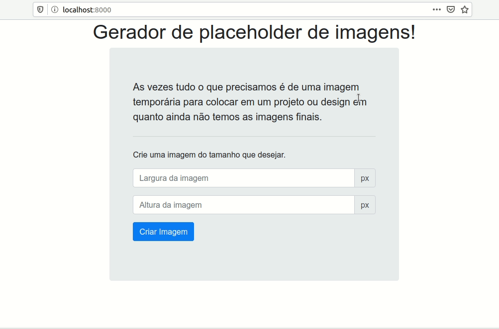

# Tutorial: Gerador de imagens placeholder

## Introdução
Criei um pequeno projeto para estudos de python e do microframework flask para aprendizagem pessoal, como forma de documentar acabei criando um tutorial passo a passo do que fiz, então resolvi compartilhar com mais pessoas.

Vamos criar um simples projeto de geração de [placeholder(espaço reservado) de imagens](https://en.wikipedia.org/wiki/Wikipedia:Image_placeholders) utilizando o microframework [Flask](https://palletsprojects.com/p/flask/) para [Python](https://www.python.org/) como backend junto com a biblioteca [Pillow](https://pypi.org/project/Pillow/) para gerar as imagens. 
Com isso quero mostrar como é fácil criar aplicações web incríveis utilizando python com flask.



## Sumario

<!-- @import "[TOC]" {cmd="toc" depthFrom=1 depthTo=6 orderedList=false} -->

<!-- code_chunk_output -->

- [Tutorial: Gerador de imagens placeholder](#tutorial-gerador-de-imagens-placeholder)
  - [Introdução](#introdução)
  - [Sumario](#sumario)
  - [Repositório](#repositório)
  - [Pré-requisitos](#pré-requisitos)
  - [Preparando o ambiente](#preparando-o-ambiente)
  - [Instalando dependências](#instalando-dependências)
    - [Criando o requirements.txt](#criando-o-requirementstxt)
  - [Hello World com Flask](#hello-world-com-flask)
  - [Planejando nossa aplicação](#planejando-nossa-aplicação)
    - [Lista de URLs](#lista-de-urls)
    - [Pagina Inicial](#pagina-inicial)
    - [Exibindo a index.html](#exibindo-a-indexhtml)
  - [Gerando imagens quadradas](#gerando-imagens-quadradas)
  - [Gerando imagens retangulares](#gerando-imagens-retangulares)
  - [Conclusão](#conclusão)

<!-- /code_chunk_output -->


## Repositório 
O projeto final está disponível no [meu github](https://github.com/williamdepaula/gerador-de-imagens-placeholder)

## Pré-requisitos
* Python 3.6 ou superior
* IDE (Ambiente de Desenvolvimento Integrado) de sua preferência, recomendo o [VSCode](https://code.visualstudio.com/)

## Preparando o ambiente
Sempre que for criar um novo projeto python crie um [virtualenv](https://virtualenv.pypa.io/en/latest/) para garantir que seus projetos e bibliotecas utilizadas fiquem isoladas do sistema base em que está rodando, garantindo maior portabilidade.
```shell{.line-numbers}
$ mkdir placeholder-generator
$ cd placeholder-generator
$ python -m venv env
$ source env/bin/activate
(env) william@william-Note:~/Flask/placeholder-generator
$ code .
```

Basicamente nos:
* **Linha 1:** criamos uma pasta para o nosso projeto.
* **Linha 2:** acessamos está pasta.
* **Linha 3:** criamos o virtualenv.
* **Linha 4:** ativamos este virtualenv.
* **Linha 6:** abrimos o vscode dentro da pasta do nosso projeto.

## Instalando dependências 
Vamos instalar o Flask e a biblioteca de imagens Pillow, lembre-se de estar com o virtualenv ativado.

```shell{.line-numbers}
$ pip install Flask Pillow
Collecting Flask
  Using cached https://files.pythonhosted.org/packages/f2/28/2a03252dfb9ebf377f40fba6a7841b47083260bf8bd8e737b0c6952df83f/Flask-1.1.2-py2.py3-none-any.whl
Collecting Pillow
  Downloading https://files.pythonhosted.org/packages/ab/f8/d3627cc230270a6a4eedee32974fbc8cb26c5fdb8710dd5ea70133640022/Pillow-7.1.2-cp37-cp37m-manylinux1_x86_64.whl (2.1MB)
    100% |████████████████████████████████| 2.1MB 3.5MB/s 
Collecting itsdangerous>=0.24 (from Flask)
  Using cached https://files.pythonhosted.org/packages/76/ae/44b03b253d6fade317f32c24d100b3b35c2239807046a4c953c7b89fa49e/itsdangerous-1.1.0-py2.py3-none-any.whl
Collecting Werkzeug>=0.15 (from Flask)
  Using cached https://files.pythonhosted.org/packages/cc/94/5f7079a0e00bd6863ef8f1da638721e9da21e5bacee597595b318f71d62e/Werkzeug-1.0.1-py2.py3-none-any.whl
Collecting click>=5.1 (from Flask)
  Using cached https://files.pythonhosted.org/packages/d2/3d/fa76db83bf75c4f8d338c2fd15c8d33fdd7ad23a9b5e57eb6c5de26b430e/click-7.1.2-py2.py3-none-any.whl
Collecting Jinja2>=2.10.1 (from Flask)
  Using cached https://files.pythonhosted.org/packages/30/9e/f663a2aa66a09d838042ae1a2c5659828bb9b41ea3a6efa20a20fd92b121/Jinja2-2.11.2-py2.py3-none-any.whl
Collecting MarkupSafe>=0.23 (from Jinja2>=2.10.1->Flask)
  Using cached https://files.pythonhosted.org/packages/98/7b/ff284bd8c80654e471b769062a9b43cc5d03e7a615048d96f4619df8d420/MarkupSafe-1.1.1-cp37-cp37m-manylinux1_x86_64.whl
Installing collected packages: itsdangerous, Werkzeug, click, MarkupSafe, Jinja2, Flask, Pillow
Successfully installed Flask-1.1.2 Jinja2-2.11.2 MarkupSafe-1.1.1 Pillow-7.1.2 Werkzeug-1.0.1 click-7.1.2 itsdangerous-1.1.0
You are using pip version 10.0.1, however version 20.1 is available.
You should consider upgrading via the 'pip install --upgrade pip' command.
```
### Criando o requirements.txt
Uma boa pratica quando se cria projeto python é criar um [requirements.tx](https://pip.pypa.io/en/latest/user_guide/#requirements-files) com todos os arquivos e dependências do projeto.
```shell
$ pip freeze > requirements.txt
```
Quando quiser instalar basta digitar o comando ``pip install -r requirements.txt`` para ter um ambiente instalado e pronto rapidamente. 

## Hello World com Flask
Vamos criar nosso primeiro programa utilizando o flask e python. Crie um arquivo com o nome
**main.py**
```python{.line-numbers}
from flask import Flask

app = Flask(__name__)

@app.route("/")
def index():
    return "Hello World!"

if __name__ == "__main__":
    app.run(port=8000, debug=True)
```

Para rodar nosso programa abra o termina, com o ``virtualenv`` ativado execute.
```shell
$ python main.py 
 * Serving Flask app "main" (lazy loading)
 * Environment: production
   WARNING: This is a development server. Do not use it in a production deployment.
   Use a production WSGI server instead.
 * Debug mode: on
 * Running on http://127.0.0.1:8000/ (Press CTRL+C to quit)
 * Restarting with stat
 * Debugger is active!
 * Debugger PIN: 356-909-478
127.0.0.1 - - [17/May/2020 18:33:28] "GET / HTTP/1.1" 200 -
127.0.0.1 - - [17/May/2020 18:33:28] "GET /favicon.ico HTTP/1.1" 404 -
```
Abra o seu navegador na página [http://localhost:8000/](http://localhost:8000/) para ver seu primeiro programa funcionar.

Vamos as explicações:
* **Linha 1:** Importação da biblioteca flask
* **Linha 3:** Aqui criamos uma instancia da classe. O argumento passado é o nome do modulo da aplicação ou pacote.
* **Linha 5:** Este é um [decorator](https://pt.wikipedia.org/wiki/Decorator) que cria uma rota "/" ao nosso projeto, ou seja toda vez que nosso projeto for acessado com a URL raiz, a função dá proxima linha será chamada.
* **Linha 6:** Criamos uma função chamada ``index()`` o nome poderia ser qualquer um ex: ``home()``, ``pagina_inicial()``. 
* **Linha 7:** A nossa função retorna uma string com a clássica frase "Hello World!"
* **Linha 9:** Verifica se nosso programa está sendo executado como um modulo importado ou se está sendo executado diretamente.
* **Linha 10:** Se nosso programa for executado diretamente inicializa nosso projeto flask, escutando na porta 8000 e em modo debug.

## Planejando nossa aplicação
Vamos agora pensar um pouco em como nosso gerador de placeholders vai funcionar. A ideia é que caso alguém queira uma imagem basta apontar a url da tag ``img`` para um endereço em nosso site que uma imagem é retornada, ex: imagine que uma pessoa queira simular um banner no inicio de seu site com a largura e altura de 800px 70px repectivamente, ele aponta a url para ``http://nossosite.com.br/800/70/`` e uma imagem é retornada com o tamanho passado como parâmetro na própria url.
Para que isso funcione vamos criar nosso projeto repondendo as seguintes URLs:

### Lista de URLs
    
**1. "/"**: Página inicial com o formulário para colocar a largura e altura da imagem gerada, junto com uma pequena apresentação do site.
**2. "/tamanho_pixel/"**:  Quando a url for um numero nossa aplicação irá criar uma imagem quadrada com o tamanho passado na url.
**3. "/largura_pixel/altura_pixel/**: Quando a url acessada tiver dois números, nossa aplicação irá criar uma imagem com a largura do primeiro número e altura do segundo número.

### Pagina Inicial
Vamos criar uma pagina inicial com um formulário perguntando a largura e altura da imagem que queremos criar.
Crie um pasta dentro do projeto chamada ``templates``, dentro dela crie um arquivo chamado ``index.html``
```shell
$ mkdir templates
$ touch templates/index.html
```
Adicione o conteúdo abaixo dentro do arquivo ``templates/index.html``

```html
<!doctype html>
<html lang="en">

<head>
    <!-- Required meta tags -->
    <meta charset="utf-8">
    <meta name="viewport" content="width=device-width, initial-scale=1, shrink-to-fit=no">

    <!-- Bootstrap CSS -->
    <link rel="stylesheet" href="https://stackpath.bootstrapcdn.com/bootstrap/4.5.0/css/bootstrap.min.css"
        integrity="sha384-9aIt2nRpC12Uk9gS9baDl411NQApFmC26EwAOH8WgZl5MYYxFfc+NcPb1dKGj7Sk" crossorigin="anonymous">

    <title>Gerador de placeholder de imagens!</title>
</head>

<body>
    <div class="row d-flex justify-content-center">
        <h1>Gerador de placeholder de imagens!</h1>
    </div>

    <div class="row d-flex justify-content-center">
        <div class="jumbotron col-md-5">
            <div class="container">
                <p class="lead">
                    As vezes tudo o que precisamos é de uma imagem temporária
                    para colocar em um projeto ou design em quanto ainda não temos as imagens
                    finais.
                </p>
                <hr class="my-4">
                <p>
                    Crie uma imagem do tamanho que desejar.
                </p>
                <p class="lead">
                <div class="input-group mb-3">
                    <input id="largura" type="text" class="form-control" placeholder="Largura da imagem"
                        aria-label="largura" aria-describedby="largura">
                    <div class="input-group-append">
                        <span class="input-group-text">px</span>
                    </div>
                </div>

                <div class="input-group mb-3">
                    <input id="altura" type="text" class="form-control" placeholder="Altura da imagem"
                        aria-label="altura" aria-describedby="altura">
                    <div class="input-group-append">
                        <span class="input-group-text">px</span>
                    </div>
                </div>
                <button id="btnCriar" class="btn btn-primary">Criar Imagem</button>
                </p>
            </div>
        </div>
    </div>

    <!-- Optional JavaScript -->
    <!-- jQuery first, then Popper.js, then Bootstrap JS -->
    <script src="https://code.jquery.com/jquery-3.5.1.slim.min.js"
        integrity="sha384-DfXdz2htPH0lsSSs5nCTpuj/zy4C+OGpamoFVy38MVBnE+IbbVYUew+OrCXaRkfj"
        crossorigin="anonymous"></script>
    <script src="https://cdn.jsdelivr.net/npm/popper.js@1.16.0/dist/umd/popper.min.js"
        integrity="sha384-Q6E9RHvbIyZFJoft+2mJbHaEWldlvI9IOYy5n3zV9zzTtmI3UksdQRVvoxMfooAo"
        crossorigin="anonymous"></script>
    <script src="https://stackpath.bootstrapcdn.com/bootstrap/4.5.0/js/bootstrap.min.js"
        integrity="sha384-OgVRvuATP1z7JjHLkuOU7Xw704+h835Lr+6QL9UvYjZE3Ipu6Tp75j7Bh/kR0JKI"
        crossorigin="anonymous"></script>

    <script>

        $("#btnCriar").click(function () {
            var largura = $('#largura').val();
            var altura = $('#altura').val();
            url = `\\${largura}\\${altura}\\`;
            window.location.href = url

        });
    </script>
</body>

</html>
```
Basicamente é uma site html simples com dois inputs, um para altura e outro para largura e um botão que envia para a url correta de geração de imagem.

### Exibindo a index.html

```python{.line-numbers}
from flask import Flask, render_template

app = Flask(__name__)

@app.route("/")
def index():
    return render_template('index.html')

if __name__ == "__main__":
    app.run(port=8000, debug=True)
```
As alterações estão nas linhas **1** onde adicionamos ao import a biblioteca ``render_template`` e na linha **7** onde agora em vez de retornar uma string retornamos nosso template renderizado como resposta ao acesso a url raiz do nosso site.

Acesse a pagina e veja nosso formulário.

É importante que o arquivo ``index.html`` esteja dentro da pasta ``templates`` dentro do nosso projeto, para que o flask o encontre corretamente, a arvore de diretório deve estar igual a isso.
```shell
.
├── main.py
├── requirements.txt
└── templates
    └── index.html
```
>Caso tenha algum problema, pare a execução do nosso projeto apertando ``CTRL+c`` na linha de comando e digite novamente ``python main.py`` mas lembre-se o virtualenv tem que estar rodando, na duvida veja **Preparando o ambiente** no começo deste tutorial.

Com isso nosso primeiro item da **Lista de URLs** está feito, vamos agora ao item 2.

## Gerando imagens quadradas
Vamos trabalhar agora no item 2 da nossa lista:

**2. "/tamanho_pixel/"**:  Quando a url for um numero nossa aplicação irá criar uma imagem quadrada com o tamanho passado na url.

Para começar vamos criar uma pasta onde nossas imagens geradas serão armazenadas.
```shell
$ mkdir imagens
```
Agora altere o ``main.py`` para ficar parecido com o arquivo abaixo.

```python{.line-numbers}
from flask import Flask, render_template, send_file
from PIL import Image

app = Flask(__name__)

@app.route("/")
def index():
    return render_template('index.html')

@app.route("/<int:tamanho>/")
def gera_imagem_quadrada(tamanho):
    tamanho = max(tamanho, 1)
    tamanho = min(tamanho, 5000)

    img = Image.new('RGB', (tamanho, tamanho), 'lightgray')
    
    nome_arquivo = f'imagens/{tamanho}x{tamanho}.png'
    img.save(nome_arquivo)

    return send_file(nome_arquivo, mimetype='image/png')

if __name__ == "__main__":
    app.run(port=8000, debug=True)
```

As alterações foram as seguintes:

* **Linha 1:** Adicionamos a importação da biblioteca send_file
* **Linha 2:** Adição da importação da biblioteca Image do Pillow para criar nossa imagem
* **Linha 10:** Criando uma nova rota(URL), essa rota recebe um numero e atribui a uma variável chamada size, o flask garante que esse valor será um numero e não uma string por que colocamos **int:** como parâmetro.
* **Linha 11:** Definimos nossa função com o nome gera_imagem_quadrada que recebe o parâmetro size, atenção esse nome de variável tem que ser igual ao nome criado na linha 10.
* **Linha 12:** A função size é uma função [built-in](https://docs.python.org/pt-br/3/library/functions.html) que retorna o maior valor entre dois números ou de uma lista. Aqui queremos garantir que o valor não seja menor ou igual a zero, pois imagem com tamanho zero ou negativo não existe.
* **Linha 13:** Semelhante a linha anterior mas agora queremos uma tamanho limite para evitar que alguém coloque um tamanho de imagem muito grande e pare nosso site pois ele ficaria muito tempo processando essa imagem.

* **Linha 15:** Criamos uma imagem com 3 camadas de cor "RGB" e com as largura e altura igual ao tamanho passado na url, o ultimo parâmetro é a cor de fundo da imagem, que no caso é um cinza claro, e salvamos em uma variável chamada ``img``.

* **Linha 17:** Estamos criando uma string que vai indicar o nome da nossa imagem e onde ela será salva, no caso dentro da pasta imagens/ e com o nome do tamanho passado como parâmetro na url, ex: caso seja acessado a url ``nosso_site/400/`` uma string com o texto ``imagens/400x400.png`` será criada.

* **Linha 18:** Agora salvamos a imagem utilizando a string criada na linha 17 ex: seguindo o exemplo anterior, ela será salva dentro da pasta ``imagens`` dentro da pasta do projeto com o nome ``400x400.png``

* **Linha 20:** Retornamos a imagem gerada e no cabeçalho da resposta informamos que é do tipo imagem no formato png.

## Gerando imagens retangulares
Estamos quase no final do nosso projeto, agora só falta o item 3 da nossa lista de funcionalidades da nossa aplicação.

Vamos ao código:
```python{.line-numbers}
from flask import Flask, render_template, send_file
from PIL import Image, ImageDraw

app = Flask(__name__)

@app.route("/")
def index():
    return render_template('index.html')

def gera_imagem(largura, altura):
    largura = max(largura, 1)
    largura = min(largura, 5000)

    altura = max(altura, 1)
    altura = min(altura, 5000)

    img = Image.new('RGB', (largura, altura), 'lightgray')

    draw = ImageDraw.Draw(img)
    tamanho_imagem = f'{largura}x{altura}'
    l, a = draw.textsize(tamanho_imagem)
    pos_x = (largura-l)/2
    pos_y = (altura-a)/2
    draw.text( ( pos_x, pos_y ), tamanho_imagem, fill="black" )
    
    nome_arquivo = f'imagens/{tamanho_imagem}.png'
    img.save(nome_arquivo)

    return nome_arquivo    

@app.route("/<int:tamanho>/")
def gera_imagem_quadrada(tamanho):

    nome_arquivo = gera_imagem(tamanho, tamanho)

    return send_file(nome_arquivo, mimetype='image/png')

@app.route("/<int:largura>/<int:altura>/")
def gera_imagem_retangular(largura, altura):

    nome_arquivo = gera_imagem(largura, altura)

    return send_file(nome_arquivo, mimetype='image/png')

if __name__ == "__main__":
    app.run(port=8000, debug=True)
```

\o/ saltamos de 20 linhas para 40, calma não se assuste basicamente fizemos o mesmo que antes com alguns pequenos incrementos, vou explicar somente o que apareceu de novo:

* **Linha 2:** Importação do modulo ImageDraw, queremos escrever na imagem e ele nos ajuda, veja mais em [ImageDraw](https://pillow.readthedocs.io/en/stable/reference/ImageDraw.html)

* **Linha 10:** Em quanto estava criando a rota de geração de imagens retangulares percebi que boa parte dela erra igual a de geração de imagens quadrada, então resolvi criar uma função que faria a parte igual entre as duas. A função gera imagem, recebe como parâmetro a largura e altura da imagem a ser gerada, ela cria a imagem e depois retorna uma string com o caminho onde ela foi salva.

* **Linhas 11 a 15:** Mesma coisa das linhas 12 e 13 da versão anterior do código, só que agora estamos trabalhando com altura e largura.

* **Linha 19:** Utilizando o modulo ImageDraw pegamos uma referencia a nossa imagem criada e salvamos na variável draw.

* **Linha 20:** Criamos uma string com o tamanho da imagem separado por x, ex: '400x300'.

* **Linha 21:** a função text_size do modulo draw retorna o tamanho de um texto passado como parâmetro para ele, no caso o texto está na variável criada na linha anterior. Está função retorna uma tupla (dois valores) com a largura e altura da imagem, que nos salvamos nas variáveis l e a repectivamente.

* **Linha 22:** pagamos o tamanho da nossa imagem e subtraímos do tamanho do nosso texto e o resultado é dividido por 2, com isso achamos o ponto onde devemos começar a desenhar nosso texto no eixo x para que ele fique centralizado.

* **Linha 23:** semelhante a linha anterior, mas agora calculamos o eixo y.

* **Linha 24:** vamos desenha no texto na imagem, passamos uma tupla com as posições x e y calculadas nas linhas 22 e 23, o texto que será escrito que está na variável ``tamanho_imagem`` e o ultimo parâmetro é a cor utilizada que no caso é preta.

* **Linha 29:** retornamos o nome do arquivo gerado.

* **Linha 34:** substituímos todas as linhas 12 a 18 da versão anterior do nosso código, onde chamamos a função que gera a imagem passado como parâmetro o tamanho da imagem e salvamos em uma variável o retorno.

* **Linha 38:** criamos uma nova rota, onde a largura e altura é passado via url.

* **Linha 39:** função que será chamada quando nossa rota da linha anterior for acessada.

* **Linha 41:** chamamos a função que gera a imagem passado como parâmetro a largura e altura da imagem e salvamos em uma variável o retorno da função.

* **Linha 43:** retornamos a imagem criada.

## Conclusão

Muita coisa para web pode ser criada facilmente utilizando o framework flask, com poucas linhas de código criamos uma aplicação simples e funcional. 
Claro que este projeto ainda não está pronto para colocar em produção, é necessário algumas melhorias, como apagar imagens antigas para que não sobrecarreguem o servidor, antes de gerar uma nova imagem, verificar se ela já existe, etc. Mas como um pequeno estudo é um bom exemplo. 